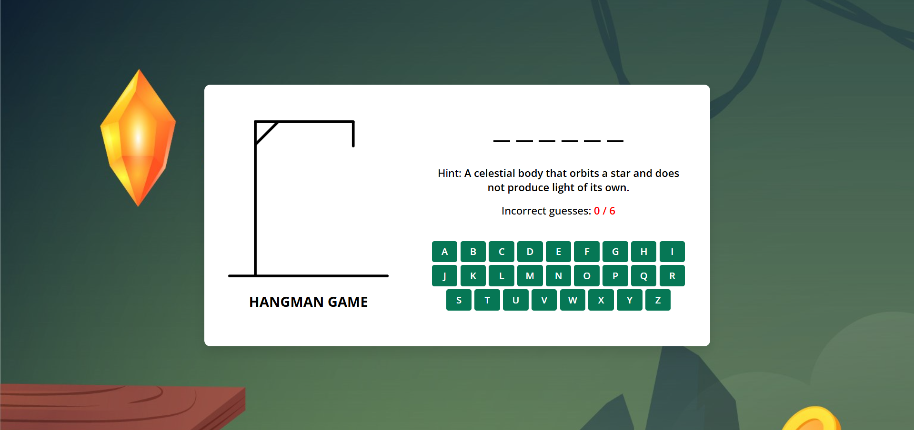

# Hangman Game

A simple, responsive Hangman game built with plain HTML, CSS, and JavaScript.

## Description

This repository contains a lightweight Hangman game you can run locally in your browser. It demonstrates DOM manipulation, game state management, and basic styling without any frameworks — ideal for beginners and for learning JavaScript interactivity.

## Features

- Random word selection
- Letter input by clicking or keyboard
- Win / lose detection with visual feedback
- Simple, responsive UI built with CSS

## Demo

To play the game locally, simply open `index.html` in your web browser:

1. Clone the repository:

   git clone https://github.com/BinaryVortex/Hangman-Game-2.git

2. Open the project folder and double-click `index.html`, or serve the folder with a simple static server.

## File Structure

- index.html — main HTML file
- style.css — styles for the game
- script.js — game logic in JavaScript
- Screenshot 2024-12-20 134636.png — project screenshot

## Technologies

- HTML
- CSS
- JavaScript (vanilla)

## Contributing

Contributions, issues, and feature requests are welcome. Feel free to open a pull request or an issue.

## License

This project is open-source. Add a license file if you want to specify terms.
